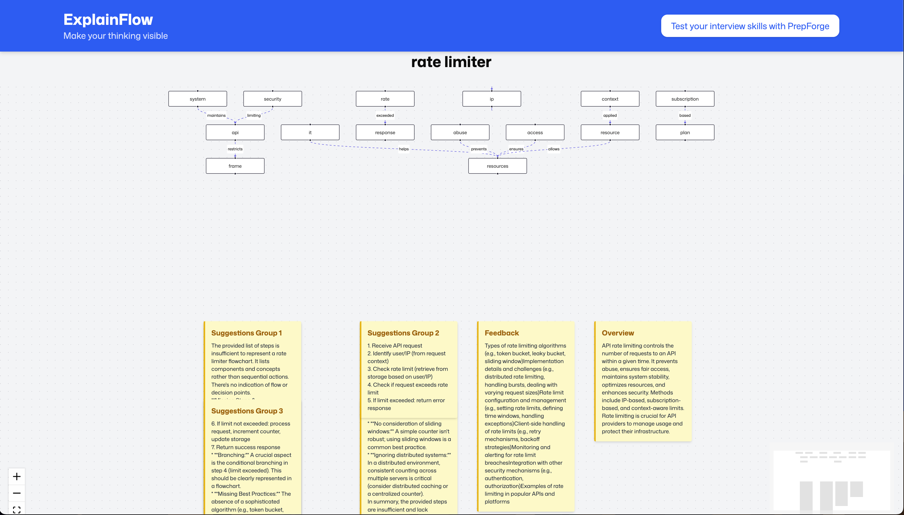

# ExplainFlow

**ExplainFlow** is an AI-powered tool that helps users visualize their explanations as flowcharts, receive feedback, and get AI-powered suggestions for improvement. It is designed for students, educators, and interviewees to make their thinking visible and structured.

---



---

## 📝 Project Description

- **ExplainFlow** allows users to input or speak their explanation on a topic.
- The backend uses NLP to extract key steps and relationships, generating a flowchart.
- The AI provides feedback on missing points and a concise overview.
- The flowchart is further analyzed for mistakes, disconnected nodes, and improvement suggestions, which are shown as sticky notes.
- The frontend is built with React and React Flow for interactive visualization.

---

## 🛠️ Tech Stack

### Frontend
- **React** (with Vite)
- **React Flow** (for flowchart visualization)
- **Tailwind CSS** (for styling)
- **Axios** (for API requests)
- **Lucide React** (icons)
- **SpeechRecognition API** (browser-based speech-to-text)

### Backend
- **Node.js** with **Express**
- **winkNLP** (for basic NLP and SVO extraction)
- **Google Gemini API** (for AI feedback and suggestions)
- **CORS**, **body-parser**
- **dotenv** (for environment variables)

---

## 📂 Project Structure

```
explainflow/
├── backend/
│   ├── index.js
│   ├── package.json
│   └── ... (other backend files)
├── frontend/
│   ├── src/
│   ├── public/
│   │   └── screen.png
│   ├── package.json
│   └── ... (other frontend files)
└── README.md
```

---

## 🚀 Getting Started

### Prerequisites

- Node.js (v18+ recommended)
- npm

### 1. Clone the repository

```bash
git clone https://github.com/yourusername/explainflow.git
cd explainflow
```

### 2. Setup Backend

```bash
cd backend
npm install
# Create a .env file with your Gemini API key:
echo "GEMINI_API_KEY=your_gemini_api_key_here" > .env
npm run dev
```

The backend runs on [http://localhost:3000](http://localhost:3000).

### 3. Setup Frontend

```bash
cd ../frontend
npm install
# Create a .env file for the frontend:
echo "VITE_BACKEND_URL=http://localhost:3000" > .env
npm run dev
```

The frontend runs on [http://localhost:5173](http://localhost:5173) (default Vite port).

---

## 🧑‍💻 Usage

1. Open the frontend in your browser.
2. Enter a topic and speak or type your explanation.
3. Click **Analyze**.
4. View the generated flowchart, feedback, overview, and AI suggestions.
5. Use the sticky notes for actionable improvements.

---

## 📚 Documentation

- **Frontend**: See `frontend/README.md` for Vite/React usage.
- **Backend**: See `backend/README.md` for Express usage.
- **Environment Variables**:
  - Backend: `.env` with `GEMINI_API_KEY`
  - Frontend: `.env` with `VITE_BACKEND_URL`

---

## 🤝 Contributing

Pull requests are welcome! For major changes, please open an issue first to discuss what you would like to change.

---

## 📄 License

MIT

---
